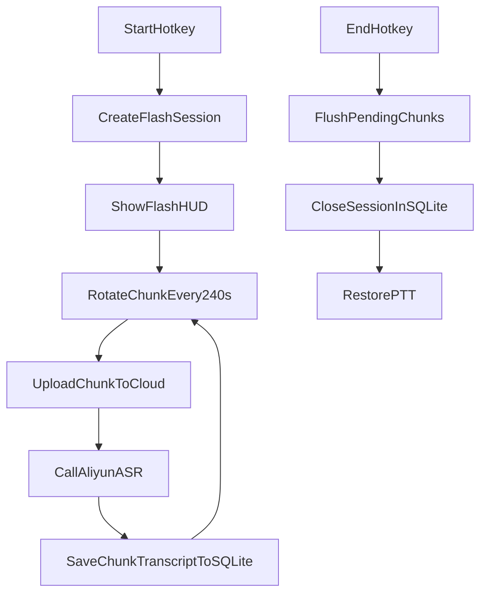

# 闪记功能实施计划（按你最新拍板）

## 已确认范围（本计划将严格执行）

- 分片时长固定 `4` 分钟，不对用户开放配置；单片技术上限 `5` 分钟。
- `P0` 总结区仅做占位文案，不做可编辑/自动总结。
- 异常中断后自动续录，沿用当前 `flashSessionId`，直到用户手动结束。
- 片段列表新增两个动作：`播放` 与 `下载`。
- 验收第一条：**不得影响现有一键转写（PTT）功能**。

## 实施步骤

- **第 1 步：固化域模型与 IPC 合约（先立边界）**
  - 扩展共享类型与常量，定义 `FlashSession` / `FlashChunk` / 闪记状态 / 片段动作类型。
  - 统一事件流：会话创建、分片开始/完成、转写完成、会话结束、自动恢复。
  - 主要文件：[/media/ctyun/datadisk1/projects/voicekey/electron/shared/types.ts](/media/ctyun/datadisk1/projects/voicekey/electron/shared/types.ts)、[/media/ctyun/datadisk1/projects/voicekey/electron/shared/constants.ts](/media/ctyun/datadisk1/projects/voicekey/electron/shared/constants.ts)、[/media/ctyun/datadisk1/projects/voicekey/electron/preload/preload.ts](/media/ctyun/datadisk1/projects/voicekey/electron/preload/preload.ts)、[/media/ctyun/datadisk1/projects/voicekey/src/global.d.ts](/media/ctyun/datadisk1/projects/voicekey/src/global.d.ts)。

- **第 2 步：新增 SQLite 持久化层（Electron 本地）**
  - 新建 `flash-note-repository`（或等价命名）封装会话与分片 CRUD，不把 SQL 散落在 `main.ts`。
  - 初始化表：`flash_sessions`、`flash_chunks`；加索引（`session_id`、`chunk_index`、`started_at`）。
  - 定义原子写入：开始即建会话、每片转写成功即更新、结束即封账。
  - 主要文件：[/media/ctyun/datadisk1/projects/voicekey/electron/main/main.ts](/media/ctyun/datadisk1/projects/voicekey/electron/main/main.ts)、[/media/ctyun/datadisk1/projects/voicekey/electron/main/config-manager.ts](/media/ctyun/datadisk1/projects/voicekey/electron/main/config-manager.ts)（应用数据目录路径复用）、新增 `electron/main/flash-note-repository.ts`。

- **第 3 步：实现闪记会话引擎（独占态 + 4 分钟轮转）**
  - 在主进程引入闪记状态机：`idle -> recording -> flushing -> completed`。
  - 开始时生成 `flashSessionId` 并切换到“闪记独占态”，阻断 PTT 新触发；结束后恢复 PTT。
  - 分片轮转固定 `240s`，并加硬上限 `300s` 保护；每片文件上传并走阿里云转写。
  - 异常中断恢复：应用重启后若检测到进行中会话，自动续录并复用会话 ID。
  - 主要文件：[/media/ctyun/datadisk1/projects/voicekey/electron/main/main.ts](/media/ctyun/datadisk1/projects/voicekey/electron/main/main.ts)、[/media/ctyun/datadisk1/projects/voicekey/electron/main/qwen-asr-provider.ts](/media/ctyun/datadisk1/projects/voicekey/electron/main/qwen-asr-provider.ts)、[/media/ctyun/datadisk1/projects/voicekey/electron/main/iohook-manager.ts](/media/ctyun/datadisk1/projects/voicekey/electron/main/iohook-manager.ts)、[/media/ctyun/datadisk1/projects/voicekey/electron/main/hotkey-manager.ts](/media/ctyun/datadisk1/projects/voicekey/electron/main/hotkey-manager.ts)。

- **第 4 步：HUD 联动（闪记开始即弹层）**
  - 复用现有 HUD 通道，新增闪记态显示：进行中时长、当前状态（录制/处理中）、会话 ID 摘要。
  - 闪记开始立即弹层，结束后显示收尾状态，处理完成后自动隐藏。
  - 主要文件：[/media/ctyun/datadisk1/projects/voicekey/src/components/HUD.tsx](/media/ctyun/datadisk1/projects/voicekey/src/components/HUD.tsx)、[/media/ctyun/datadisk1/projects/voicekey/electron/main/main.ts](/media/ctyun/datadisk1/projects/voicekey/electron/main/main.ts)。

- **第 5 步：闪记页接入真实数据 + 片段播放/下载**
  - 将 `SketchesPage` 从当前 mock 状态切换为 IPC 拉取 SQLite 会话/分片。
  - 片段项增加两个 icon 按钮：`播放`（本地文件/URL 播放）与 `下载`（保存副本或打开下载链接）。
  - 总结区保留占位文案，不开放编辑。
  - 主要文件：[/media/ctyun/datadisk1/projects/voicekey/src/pages/SketchesPage.tsx](/media/ctyun/datadisk1/projects/voicekey/src/pages/SketchesPage.tsx)、[/media/ctyun/datadisk1/projects/voicekey/src/components/ui/](/media/ctyun/datadisk1/projects/voicekey/src/components/ui/)、[/media/ctyun/datadisk1/projects/voicekey/electron/preload/preload.ts](/media/ctyun/datadisk1/projects/voicekey/electron/preload/preload.ts)。

- **第 6 步：回归与验收（先保 PTT）**
  - 回归 PTT 全链路：快捷键触发、录音、转写、注入、HUD 表现。
  - 闪记验收：开始创建 ID、4 分钟切片、阿里云转写成功、SQLite 可查、片段可播可下。
  - 异常场景：断网、转写失败、应用重启自动续录、结束后恢复 PTT。

## 数据流（实现视图）

## 关键落地约束

- 闪记独占只在“进行中”生效；默认状态始终保持 PTT 可用。
- 不新增“分片时长设置 UI”，固定常量实现，减少误配与测试面。
- 数据层与流程层分离：SQL 仓储层不直接依赖 UI；UI 仅消费 IPC DTO。
- 任何闪记失败都必须可见且可追溯（日志 + DB 状态）。
